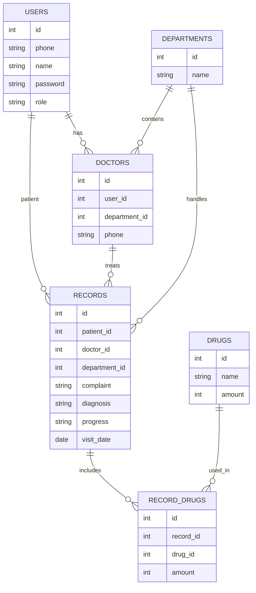

# 医院管理系统数据库设计

> 本文档描述医院管理系统所需的数据库表结构、ER 图（Mermaid）

---

## 一、数据库表结构说明

### 1. users（用户表）

用于登录与注册

| 字段名        | 类型                 | 说明                       |
| ---------- | ------------------ | ------------------------ |
| id         | INT PK AI          | 用户 ID                    |
| phone      | VARCHAR(20) UNIQUE | 手机号（登录账号）                |
| name       | VARCHAR(64)        | 姓名                       |
| password   | VARCHAR(64)        | 明文密码                     |
| role       | ENUM               | patient / doctor / admin |
| created_at | TIMESTAMP          | 创建时间                     |

---

### 2. departments（科室表）

| 字段名  | 类型                 | 说明    |
| ---- | ------------------ | ----- |
| id   | INT PK AI          | 科室 ID |
| name | VARCHAR(64) UNIQUE | 科室名称  |

---

### 3. doctors（医生表）

| 字段名           | 类型            | 说明          |
| ------------- | ------------- | ----------- |
| id            | INT PK AI     | 医生 ID       |
| user_id       | INT UNIQUE FK | 对应 users.id |
| department_id | INT FK        | 所属科室        |
| phone         | VARCHAR(20)   | 电话          |
| created_at    | TIMESTAMP     | 创建时间        |

---

### 4. drugs（药品表）

| 字段名        | 类型                 | 说明    |
| ---------- | ------------------ | ----- |
| id         | INT PK AI          | 药品 ID |
| name       | VARCHAR(64) UNIQUE | 药品名称  |
| amount     | INT                | 库存数量  |
| created_at | TIMESTAMP          | 创建时间  |

---

### 5. records（就诊记录表）

| 字段名           | 类型        | 说明                          |
| ------------- | --------- | --------------------------- |
| id            | INT PK AI | 记录 ID                       |
| patient_id    | INT FK    | 患者（users）                   |
| doctor_id     | INT FK    | 医生                          |
| department_id | INT FK    | 科室                          |
| complaint     | TEXT      | 主诉                          |
| diagnosis     | TEXT      | 诊断                          |
| progress      | ENUM      | pending / processing / done |
| visit_date    | DATE      | 就诊日期                        |
| created_at    | TIMESTAMP | 创建时间                        |

---

### 6. record_drugs（病历-药品表）

| 字段名       | 类型        | 说明   |
| --------- | --------- | ---- |
| id        | INT PK AI | ID   |
| record_id | INT FK    | 就诊记录 |
| drug_id   | INT FK    | 药品   |
| amount    | INT       | 数量   |

---

## 二、ER 图（Mermaid）



---

## 三、数据库初始化 SQL 脚本

```sql
-- 删除旧表
DROP TABLE IF EXISTS record_drugs;
DROP TABLE IF EXISTS records;
DROP TABLE IF EXISTS doctors;
DROP TABLE IF EXISTS drugs;
DROP TABLE IF EXISTS departments;
DROP TABLE IF EXISTS users;

-- users
CREATE TABLE users (
    id INT PRIMARY KEY AUTO_INCREMENT,
    phone VARCHAR(20) NOT NULL UNIQUE,
    name VARCHAR(64) NOT NULL,
    password VARCHAR(64) NOT NULL,
    role ENUM('patient','doctor','admin') NOT NULL,
    created_at TIMESTAMP DEFAULT CURRENT_TIMESTAMP
);

-- departments
CREATE TABLE departments (
    id INT PRIMARY KEY AUTO_INCREMENT,
    name VARCHAR(64) NOT NULL UNIQUE
);

-- doctors
CREATE TABLE doctors (
    id INT PRIMARY KEY AUTO_INCREMENT,
    user_id INT NOT NULL UNIQUE,
    department_id INT NOT NULL,
    phone VARCHAR(20) NOT NULL,
    created_at TIMESTAMP DEFAULT CURRENT_TIMESTAMP,
    FOREIGN KEY (user_id) REFERENCES users(id) ON DELETE CASCADE,
    FOREIGN KEY (department_id) REFERENCES departments(id)
);

-- drugs
CREATE TABLE drugs (
    id INT PRIMARY KEY AUTO_INCREMENT,
    name VARCHAR(64) NOT NULL UNIQUE,
    amount INT NOT NULL,
    created_at TIMESTAMP DEFAULT CURRENT_TIMESTAMP
);

-- records
CREATE TABLE records (
    id INT PRIMARY KEY AUTO_INCREMENT,
    patient_id INT NOT NULL,
    doctor_id INT,
    department_id INT NOT NULL,
    complaint TEXT NOT NULL,
    diagnosis TEXT,
    progress ENUM('pending','processing','done') DEFAULT 'pending',
    visit_date DATE NOT NULL,
    created_at TIMESTAMP DEFAULT CURRENT_TIMESTAMP,
    FOREIGN KEY (patient_id) REFERENCES users(id),
    FOREIGN KEY (doctor_id) REFERENCES doctors(id),
    FOREIGN KEY (department_id) REFERENCES departments(id)
);

-- record_drugs
CREATE TABLE record_drugs (
    id INT PRIMARY KEY AUTO_INCREMENT,
    record_id INT NOT NULL,
    drug_id INT NOT NULL,
    amount INT NOT NULL,
    FOREIGN KEY (record_id) REFERENCES records(id) ON DELETE CASCADE,
    FOREIGN KEY (drug_id) REFERENCES drugs(id)
);

-- 插入管理员
INSERT INTO users (phone, name, password, role)
VALUES ('00000000', 'admin', 'admin', 'admin');

-- 插入科室
INSERT INTO departments (name) VALUES
('内科'), ('外科'), ('儿科');

-- 插入医生
INSERT INTO users (phone, name, password, role)
VALUES ('13800000001', '张多克', '123456', 'doctor');

INSERT INTO doctors (user_id, department_id, phone)
VALUES (LAST_INSERT_ID(), 1, '13800000001');

-- 插入患者
INSERT INTO users (phone, name, password, role)
VALUES ('13900000001', '李拍选', '123456', 'patient');

-- 插入药品
INSERT INTO drugs (name, amount) VALUES
('阿司匹林', 100),
('青霉素', 50);

-- 插入就诊记录
INSERT INTO records (patient_id, doctor_id, department_id, complaint, diagnosis, progress, visit_date)
VALUES (2, 1, 1, '头痛发烧', '感冒', 'done', '2025-01-01');

-- 插入用药记录
INSERT INTO record_drugs (record_id, drug_id, amount)
VALUES (1, 1, 2);
```

---

## 四、说明

* 管理员账号：
  * phone：`00000000`
  * password：`admin`
