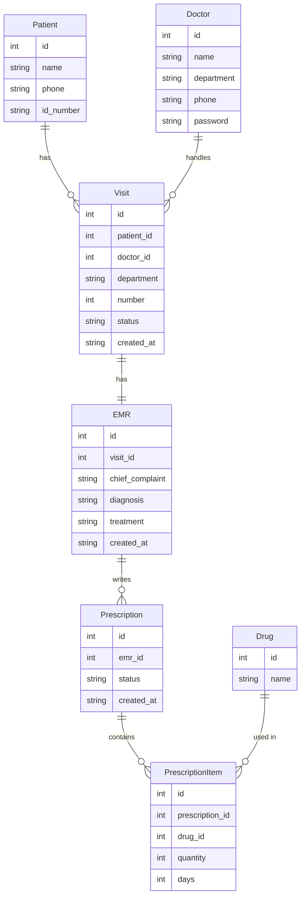

### ER 图




### 创建数据库和表


``` bash

cat ./0.create_database.sql | sqlite3 hospital.db 

```

### 注入假数据

``` bash

cat ./1.drugs.sql | sqlite3 hospital.db

cat ./2.doctor.sql | sqlite3 hospital.db

```


