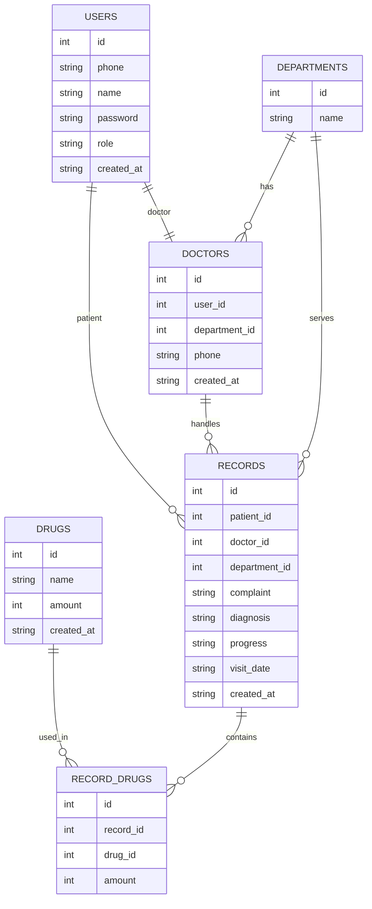

# 医院预约与诊断系统  
## 数据库设计说明与范式分析

---

## 1. 设计目标概述

本数据库设计用于支持“医院预约与诊断系统”，满足以下目标：

- 支持多角色用户（学生 / 医生 / 管理员）
- 支持预约、诊断、用药等核心业务流程
- 保证数据一致性，避免冗余
- 结构清晰，易于扩展和维护

数据库设计遵循**关系数据库规范化理论**，至少满足**第三范式（3NF）**。

---

## 2. 表结构说明

### 2.1 users 表（用户表）

```sql
CREATE TABLE users (
    id INTEGER PRIMARY KEY AUTOINCREMENT,
    phone TEXT NOT NULL UNIQUE,
    name TEXT NOT NULL,
    password TEXT NOT NULL,
    role TEXT CHECK(role IN ('patient','doctor','admin')) NOT NULL,
    created_at TIMESTAMP DEFAULT CURRENT_TIMESTAMP
);
````

#### 字段说明

| 字段名        | 含义     | 设计说明            |
| ---------- | ------ | --------------- |
| id         | 用户唯一标识 | 主键，避免使用业务字段作为主键 |
| phone      | 手机号    | 唯一约束，用于登录与身份识别  |
| name       | 用户姓名   | 基本展示信息          |
| password   | 登录密码   | 与身份认证相关         |
| role       | 用户角色   | 区分学生 / 医生 / 管理员 |
| created_at | 创建时间   | 记录用户注册时间        |

#### 设计说明

* 将**所有系统用户统一放入 users 表**，避免多张用户表带来的冗余
* 使用 `role` 字段区分权限，符合**单表继承（Single Table Inheritance）**思想
* 用户的通用属性只存一份，减少更新异常

---

### 2.2 departments 表（科室表）

```sql
CREATE TABLE departments (
    id INTEGER PRIMARY KEY AUTOINCREMENT,
    name TEXT NOT NULL UNIQUE
);
```

#### 字段说明

| 字段名  | 含义     |
| ---- | ------ |
| id   | 科室唯一标识 |
| name | 科室名称   |

#### 设计说明

* 科室作为**独立实体**，避免在医生或预约表中重复存储科室名称
* 使用唯一约束防止出现重名科室

---

### 2.3 doctors 表（医生信息表）

```sql
CREATE TABLE doctors (
    id INTEGER PRIMARY KEY AUTOINCREMENT,
    user_id INTEGER NOT NULL UNIQUE,
    department_id INTEGER NOT NULL,
    phone TEXT NOT NULL,
    created_at TIMESTAMP DEFAULT CURRENT_TIMESTAMP,
    FOREIGN KEY (user_id) REFERENCES users(id) ON DELETE CASCADE,
    FOREIGN KEY (department_id) REFERENCES departments(id)
);
```

#### 字段说明

| 字段名           | 含义               |
| ------------- | ---------------- |
| id            | 医生业务主键           |
| user_id       | 对应 users 表中的医生用户 |
| department_id | 所属科室             |
| phone         | 医生联系方式           |
| created_at    | 创建时间             |

#### 设计说明

* 医生是“用户”的一种**角色扩展**
* 医生特有的信息（科室、联系方式）单独拆表
* 使用 `user_id` 作为唯一外键，保证一名医生只对应一个用户账号

---

### 2.4 drugs 表（药品表）

```sql
CREATE TABLE drugs (
    id INTEGER PRIMARY KEY AUTOINCREMENT,
    name TEXT NOT NULL UNIQUE,
    amount INTEGER NOT NULL,
    created_at TIMESTAMP DEFAULT CURRENT_TIMESTAMP
);
```

#### 字段说明

| 字段名        | 含义     |
| ---------- | ------ |
| id         | 药品唯一标识 |
| name       | 药品名称   |
| amount     | 库存数量   |
| created_at | 添加时间   |

#### 设计说明

* 药品作为独立实体管理
* 库存数量集中存储，避免在诊断记录中冗余

---

### 2.5 records 表（就诊 / 预约记录表）

```sql
CREATE TABLE records (
    id INTEGER PRIMARY KEY AUTOINCREMENT,
    patient_id INTEGER NOT NULL,
    doctor_id INTEGER,
    department_id INTEGER NOT NULL,
    complaint TEXT NOT NULL,
    diagnosis TEXT,
    progress TEXT CHECK(progress IN ('pending','processing','done')) DEFAULT 'pending',
    visit_date DATE NOT NULL,
    created_at TIMESTAMP DEFAULT CURRENT_TIMESTAMP,
    FOREIGN KEY (patient_id) REFERENCES users(id),
    FOREIGN KEY (doctor_id) REFERENCES doctors(id),
    FOREIGN KEY (department_id) REFERENCES departments(id)
);
```

#### 字段说明

| 字段名           | 含义        |
| ------------- | --------- |
| id            | 就诊记录唯一标识  |
| patient_id    | 学生用户      |
| doctor_id     | 接诊医生      |
| department_id | 就诊科室      |
| complaint     | 主诉        |
| diagnosis     | 诊断结果      |
| progress      | 预约 / 诊断状态 |
| visit_date    | 就诊日期      |
| created_at    | 记录创建时间    |

#### 设计说明

* 一条 record 表示一次完整的预约 + 诊断流程
* 使用状态字段 `progress` 描述业务阶段
* 医生允许为空，支持“尚未分配医生”的预约状态

---

### 2.6 record_drugs 表（处方药品关联表）

```sql
CREATE TABLE record_drugs (
    id INTEGER PRIMARY KEY AUTOINCREMENT,
    record_id INTEGER NOT NULL,
    drug_id INTEGER NOT NULL,
    amount INTEGER NOT NULL,
    FOREIGN KEY (record_id) REFERENCES records(id) ON DELETE CASCADE,
    FOREIGN KEY (drug_id) REFERENCES drugs(id)
);
```

#### 字段说明

| 字段名       | 含义   |
| --------- | ---- |
| id        | 主键   |
| record_id | 就诊记录 |
| drug_id   | 药品   |
| amount    | 使用数量 |

#### 设计说明

* 解决“一次诊断可使用多种药品”的**多对多关系**
* 采用中间表，符合关系数据库设计规范

---

## 3. 范式分析

### 3.1 第一范式（1NF）

**要求：**

* 字段不可再分
* 每个字段存储原子值

**本设计满足原因：**

* 所有字段均为单值（如 phone、name、amount）
* 无重复组、无数组字段

---

### 3.2 第二范式（2NF）

**要求：**

* 满足 1NF
* 非主属性完全依赖主键

**本设计满足原因：**

* 每张表主键为单字段（id）
* 非主键字段全部依赖主键
* 不存在“部分依赖”的情况

---

### 3.3 第三范式（3NF）

**要求：**

* 满足 2NF
* 不存在非主属性对非主属性的传递依赖

**本设计满足原因：**

| 情况     | 处理方式           |
| ------ | -------------- |
| 用户信息   | 单独 users 表     |
| 医生扩展信息 | doctors 表      |
| 科室名称   | departments 表  |
| 药品信息   | drugs 表        |
| 用药关系   | record_drugs 表 |

所有描述性字段均依赖于本表主键，而非其他非主键字段。

---

## 4. 设计优势总结

### 4.1 数据一致性

* 统一用户表，避免多处维护用户信息
* 外键约束保证引用合法性

### 4.2 降低数据冗余

* 科室、药品信息只存一份
* 多对多关系使用中间表

### 4.3 易扩展性

* 可扩展更多角色（如护士）
* 可扩展更多业务表（检查项目、收费记录）

### 4.4 业务语义清晰

* 表结构直接映射业务概念
* 便于开发、调试与维护


---

## ER 图


