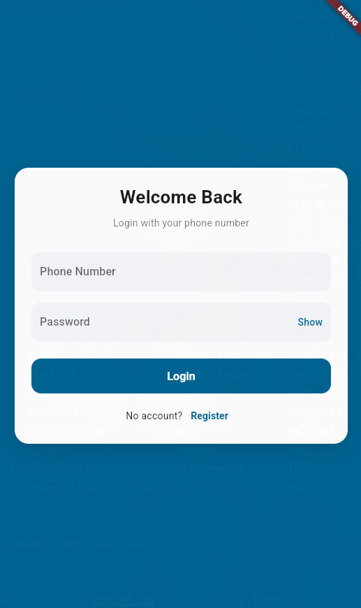
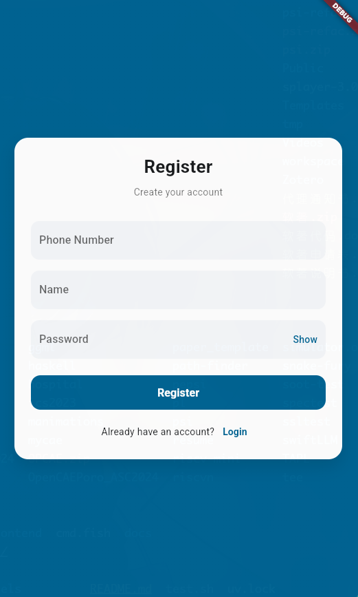
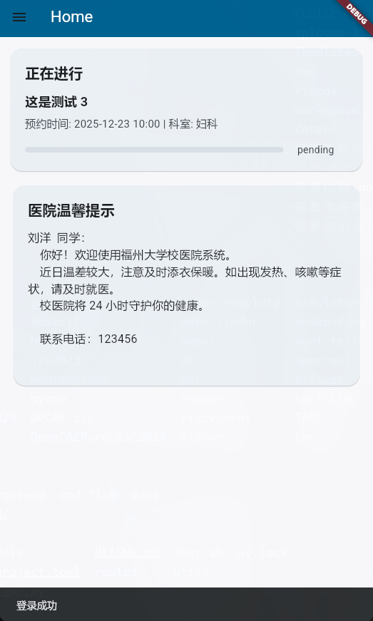
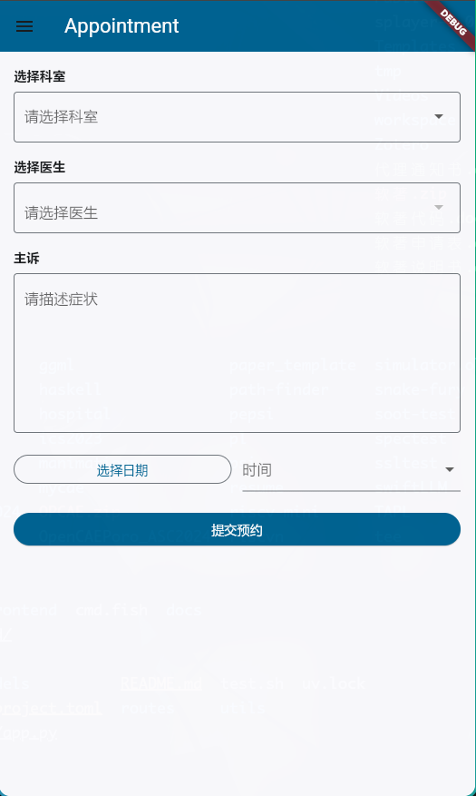
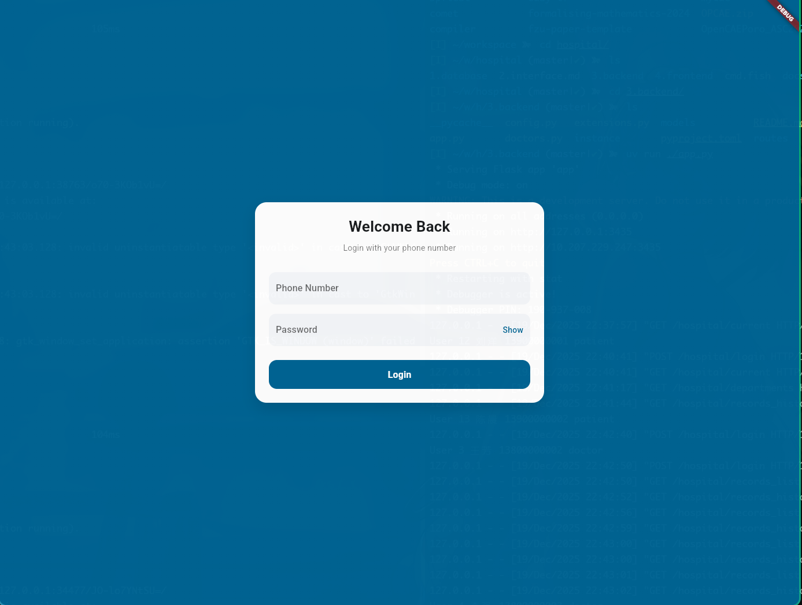
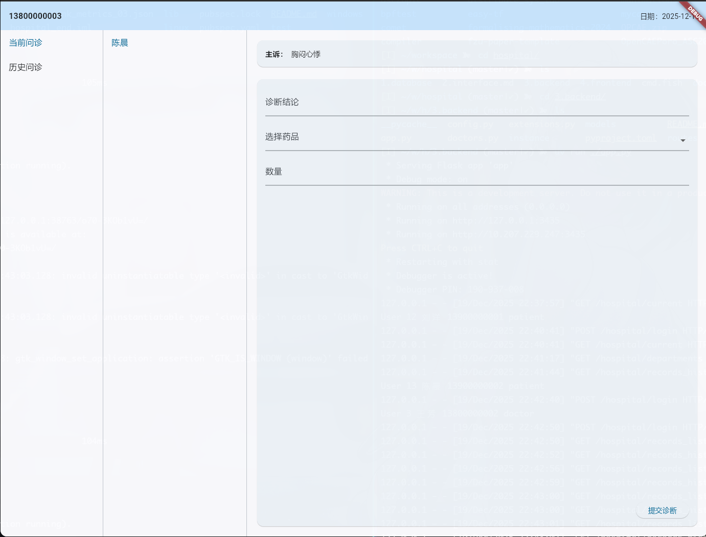
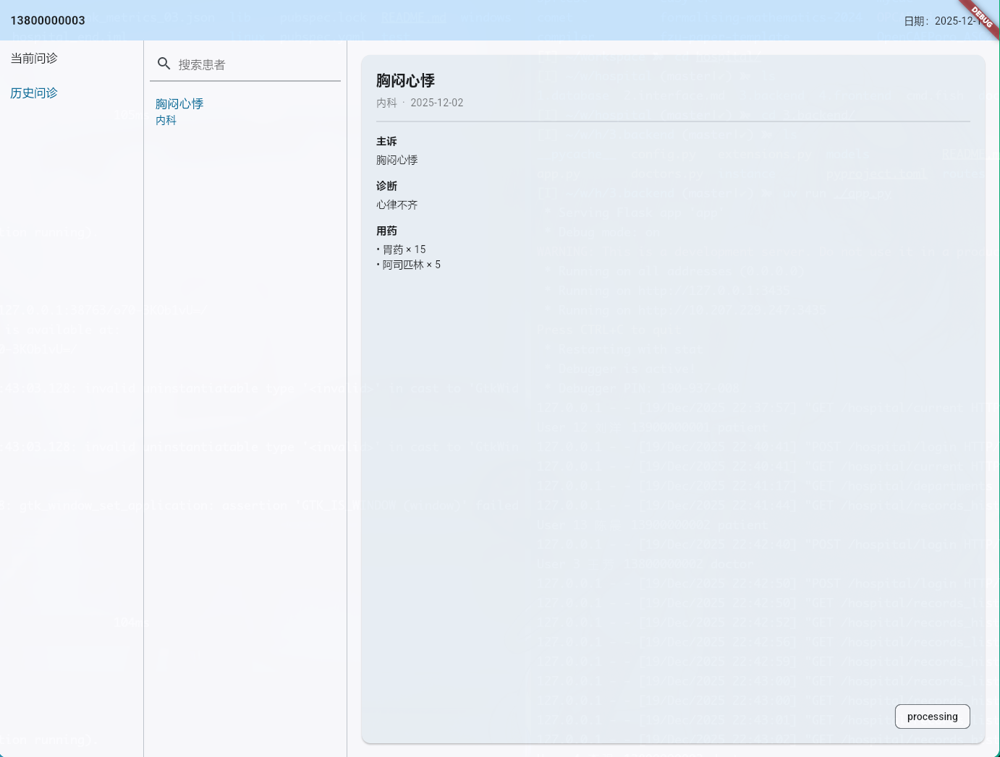
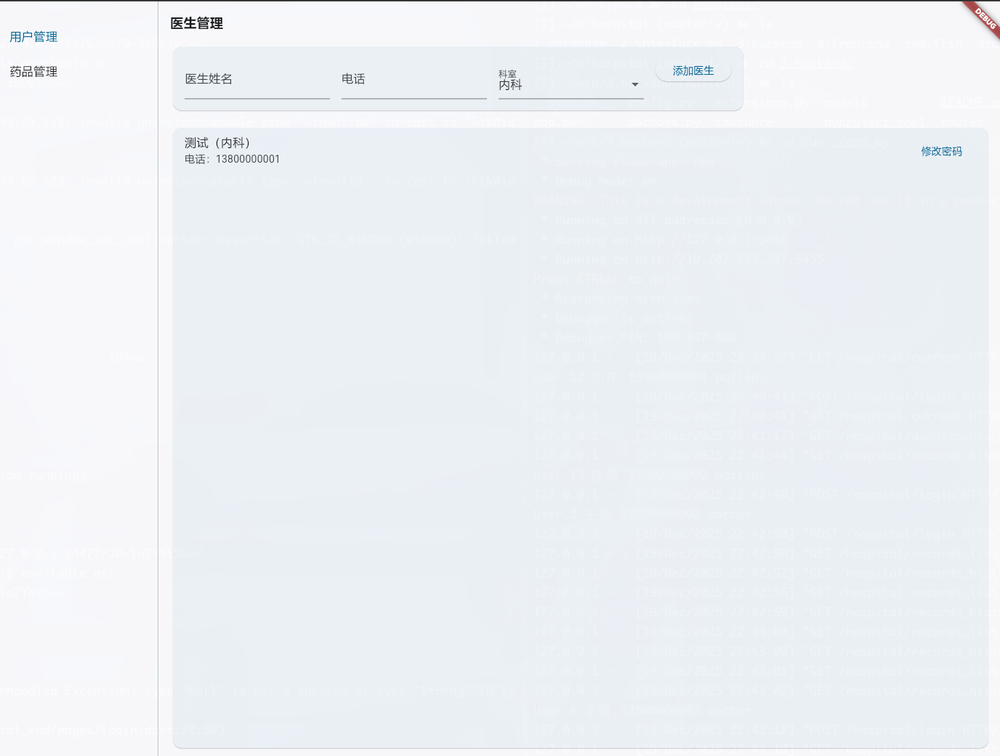
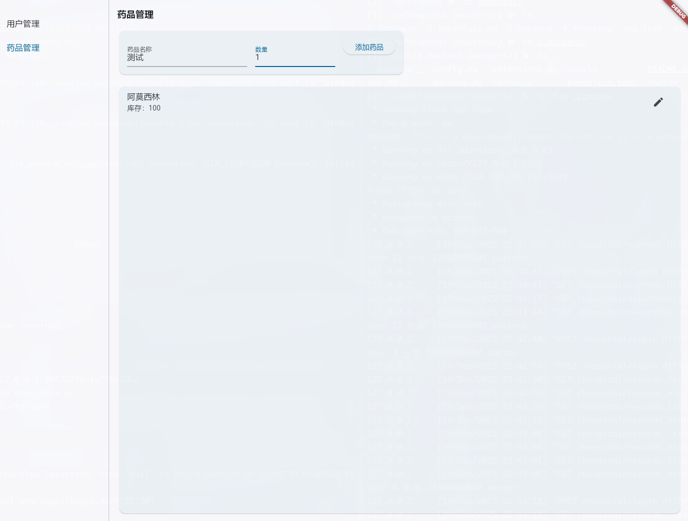

# 医院预约与诊断系统  

## 前端实现说明（Flutter）

---

## 1. 前端技术概述

本系统前端使用 **Flutter** 框架实现，采用**前后端分离架构**，通过 HTTP 接口与后端服务进行数据交互。

### 技术特点
- 使用 Flutter 统一 UI 技术栈
- 学生端：移动端 APP（Android / iOS）
- 医院端：桌面端应用（Windows / Linux）
- 与后端通过 RESTful API 进行通信
- 使用 Token 进行身份认证与权限控制

---

## 2. 前端系统架构

前端根据用户角色分为两个独立端：

- **学生端（移动端 App）**
- **医院端（桌面端应用）**

不同端在功能和界面布局上分别进行了针对性设计。

---

## 3. 学生端（移动端 App）

学生端主要面向学生用户，提供预约与就诊信息查询功能，界面以简洁、易操作为设计目标。

### 3.1 登录页面（Login）

**功能说明**

- 学生通过手机号和密码登录系统
- 登录成功后进入首页

**界面截图**

---

### 3.2 注册页面（Register）

**功能说明**

- 新用户进行账号注册
- 填写手机号、姓名和密码

**界面截图**

---

### 3.3 首页（Home）

**功能说明**
- 显示当前正在进行的预约 / 就诊事件
- 展示预约时间、科室及状态信息

**界面截图**

---

### 3.4 新建预约页面（Appointment）

**功能说明**
- 选择科室和医生
- 填写病情描述
- 选择预约日期并提交预约

**界面截图**

---

### 3.5 历史记录页面（History）

**功能说明**
- 查看历史预约记录
- 查看医生给出的诊断结果和用药信息

**界面截图**

---

## 4. 医院端（桌面端应用）

医院端主要面向医生和管理人员，提供诊断处理与基础数据管理功能，界面采用更适合桌面端操作的布局。

---

### 4.1 登录页面（Login）

**功能说明**
- 医生或管理员登录系统
- 根据角色进入不同功能页面

**界面截图**

---

### 4.2 诊断页面（Diagnostic，医生端）

**功能说明**
- 查看当前已预约的患者列表
- 点击预约记录查看病情描述
- 填写诊断结果并开具药品

**界面截图**

---

### 4.3 历史诊断页面（History，医生端）

**功能说明**
- 查看医生曾经诊断过的预约记录
- 查询历史诊断结果和用药信息

**界面截图**

---

### 4.4 医生管理页面（Doctor Manage，管理端）

**功能说明**
- 管理员添加新医生
- 删除或管理现有医生信息

**界面截图**

---

### 4.5 药品管理页面（Drug Manage，管理端）

**功能说明**
- 添加新药品
- 查看和管理药品库存信息

**界面截图**

---

## 5. 小结

本系统前端基于 Flutter 实现，通过清晰的页面划分与角色权限控制，实现了学生预约就诊与医院诊断管理的完整流程。系统界面简洁直观，功能模块清晰，具备良好的可扩展性和跨平台能力。

